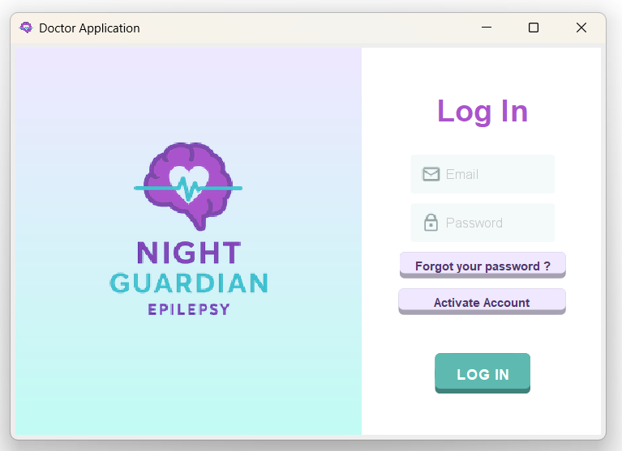
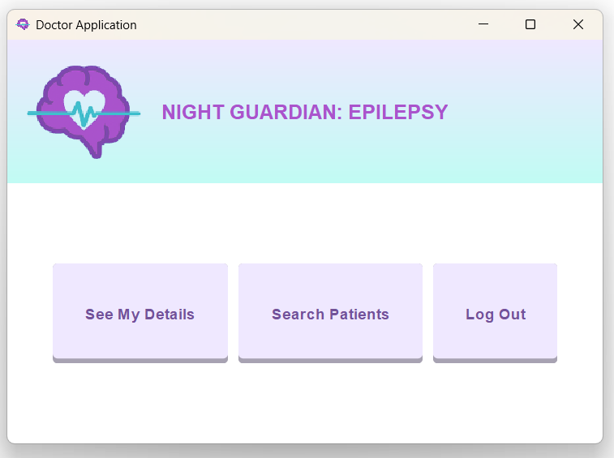
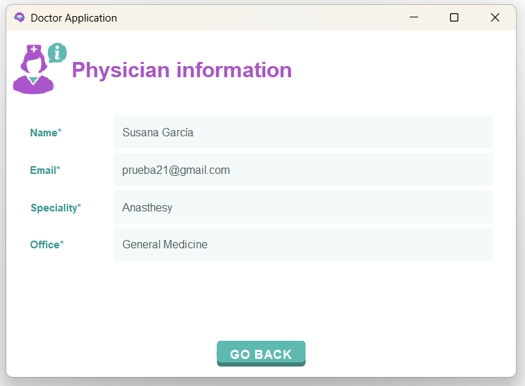
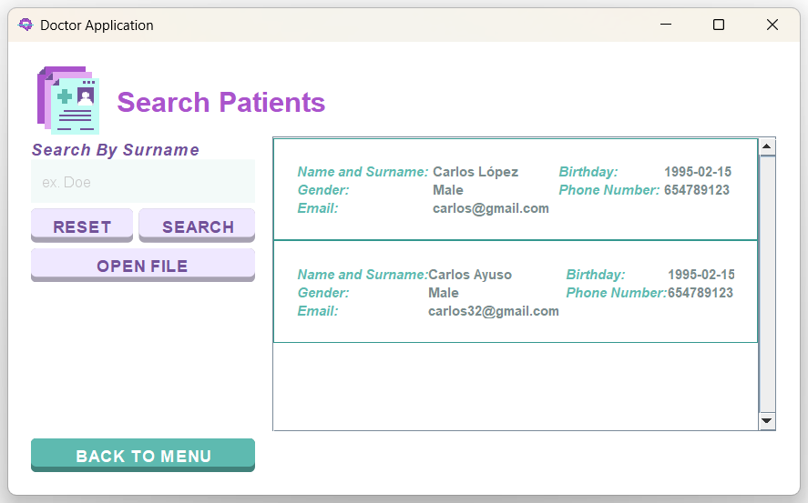
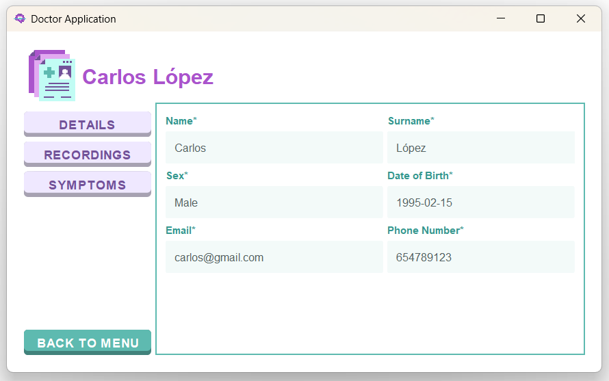
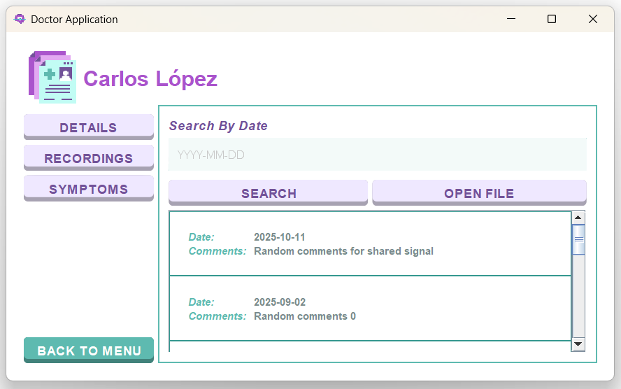
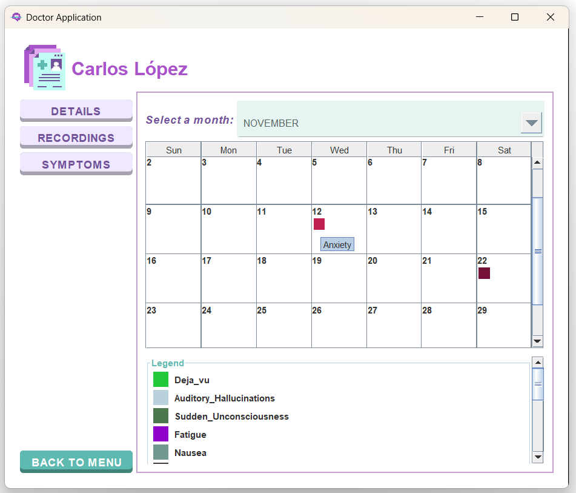
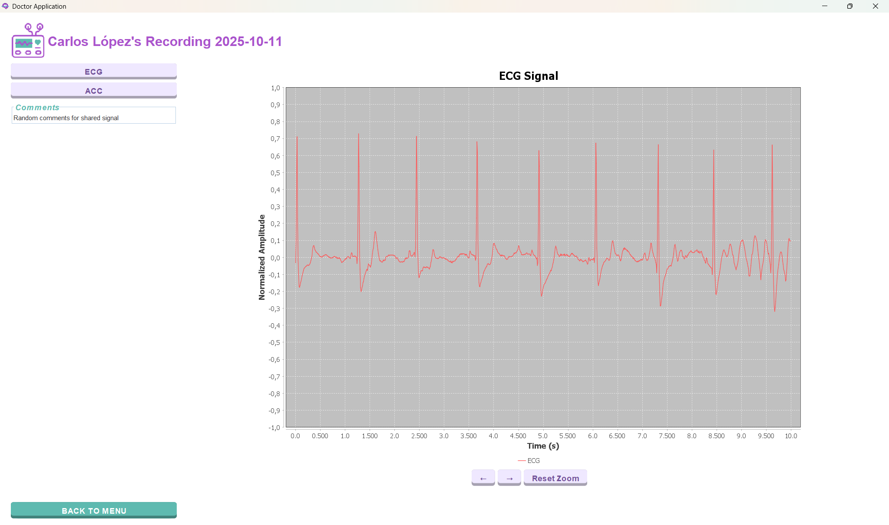
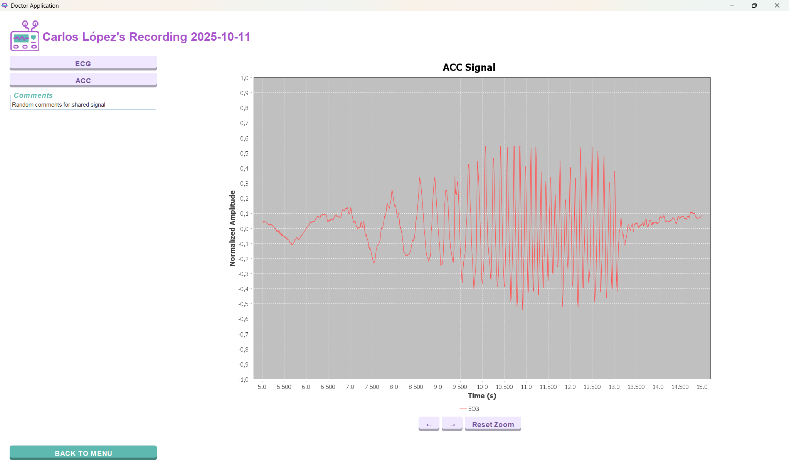

# 🧠 Night Guardian — Doctor Application User Guide

The Night Guardian platform enables clinicians to remotely monitor epilepsy patients using ECG, accelerometer (ACC) signals, symptom tracking, and structured clinical data.
This guide explains how to use the Doctor Application step by step, following the workflow a doctor will typically perform during daily use.

## Table of Contents
- [How to Download and Run](#how-to-download-and-run)
- [Initial Conditions](#initial-conditions)
- [Summary of Doctor Capabilities](#summary-of-doctor-capabilities)
- [User Interface Guide](#user-interface-guide)
- [Connecting to the Server](#1-connecting-to-the-server)
- [Logging In](#2-logging-in)
- [Main Menu](#3-main-menu)
- [Patient Management](#4-finding-and-selecting-patients)
- [Patient Profile](#5-patient-profile)
- [Reviewing Physiological Signals](#6-signal-viewer)
- [Handling Network Disruptions](#7-handling-network-disruptions)
- [Authors](#authors)

## How to Download and Run

1. Clone the repository:
    ```bash
    git clone https://github.com/MamenCortes/EpilepsyDoctor.git
    ```
2. Navigate to the project root folder.
3. Run the executable **.jar** file:
    ```bash
    java -jar EpilepsyDoctor.jar
    ```
   Alternatively, you may run the program from your IDE by executing the `Application.java` class inside the project.
   
## Initial Conditions
Upon executing the system for the first time, the following users will be automatically added to facilitate the system's navigation: 

| Email  | Password   | Role     |
|-----------|------------|----------|
| ester.exposito@nightguardian.com     | esterexposito1   | Doctor    |

> Disclaimer: their public and private keys are in the project for testing purposes

## Summary of Doctor Capabilities

With the Doctor Application, you can:

* Connect securely to the Night Guardian Server
* Log in using authenticated corporate credentials
* Access all assigned patient records
* Navigate patient information and physiological data
* Review symptom calendars
* View ECG and ACC recordings with interactive tools
* Add clinical comments
* Access your own information

# User Interface Guide
## 1. Connecting to the Server

When launching the Doctor Application, a dialog box appears requesting the **Server IP address**.


### Requirements for a Successful Connection

* Ensure your computer is on the **same local network** as the server.
* If connection fails repeatedly, adjust or temporarily disable the **firewall** (as permitted by your organization).
* To find the computer’s IP:

  * **Windows:** Open *Command Prompt* → `ipconfig`
  * **Mac/Linux:** Open *Terminal* → `ifconfig`
  * Note that the IP required is not the one of your computer, but the computer's IP where the server is hosted. 

Once the IP is introduced, you can click:

* **OK**
  * If the IP is correct, the login screen will appear.
  * If incorrect, an error message is shown.
* **Cancel**
  * The application closes immediately.

A successful server connection is required before proceeding to authentication.

## 2. Logging In

After connecting, you will be taken to the **Login Screen**.



### **Account Access**

When you are granted access to the Night Guardian platform for the first time, the hospital’s **IT department** will provide you with:

* A **corporate email address** (ending in `@nightguardian.com`)
* A **temporary password**
* A **single-use token** to activate your account

You cannot create or register your own account.

### First-Time Access & Account Activation

When a doctor accesses the Night Guardian platform for the first time, their account must be activated to ensure secure and authenticated access. Follow the next steps: 

1. **Click “Activate Account”** on the login screen.
  This opens the activation panel required for first-time setup.

2. **Enter your corporate email, temporary password, and single-use activation token.**
  These credentials are provided by the hospital IT department and verify your identity.
  
  
  
  3. **Upon successful validation, the system automatically generates your cryptographic keys:**

      * A **private key**, stored safely on your device
      * A **public key**, sent to the server and saved in the database
        This establishes an encrypted communication channel unique to your account.

4. **Choose a new password** to replace the temporary one.
  The system will only accept passwords that meet the security requirements: minimum 8 characters and at least one special character.

5. **Log in normally** with your corporate email and new password and start exploring the App.


### Change password
To change the password, introduce a valid email and then click **"Forgot you password?"**. Then introduce the new password and click **Save**. 


### Login
Once you activate your account, the next times you enter the App, you can LogIn normally from your computer. Just enter:

* Your corporate **Night Guardian email** (`@nightguardian.com`)
* Your **password** (minimum 8 characters + at least one special character/number)

Then click **Log In**. The possible outcomes are: 

* **Successful login** → access to the Doctor Main Menu
* **Incorrect credentials / insufficient permissions** → error message. Retry entering a valid email and password. 

## 3. Main Menu

After login, the **Doctor Main Menu** is displayed. It acts as the navigation hub for all medical features.


The available options are: 

#### **3.1 See my details**
Displays your profile details (name, email, department, speciality, contact details, etc.). You cannot change the information. If you need to change any details, please contact the **IT department**. 



#### **3.2 Search Patients**

Opens the patient list assigned to you by the administrator.

#### **3.3 Log Out**

Ends the current session and returns to the login screen. The connection to the server won't be lost unless you close the App. 

## 4. Finding and Selecting Patients

Choose **Search Patients** to access the list of your patients.



* Enter a **surname** and press **Search**: The list filters matching patients.
* Press **Reset**: All assigned patients are shown again.

To open a patient’s profile, select a patient and click **Open File**.

## 5. Patient Profile

The patient profile contains three main tabs:

#### 5.1 Details: Personal Information

Displays demographic and administrative details:

* Name and surname
* Date of birth
* Gender
* Contact details

This section provides basic context of the patient.



#### 5.2 Physiological Signal Recordings

Lists all ECG and ACC recordings performed by the patient. Each report contains an ECG and ACC recording. Here you can: 

* **Filter reports by date**
* **Reset** to display all originals
* Select a report and click **Open File** to access the **Signal Viewer**



#### 5.3 Symptom Calendar

Visualizes symptoms reported by the patient on a **monthly calendar**. Features: 

* **Colored squares** indicate symptoms
* Hover to display the symptom name
* A color legend identifies each symptom category
* A **month selector** allows browsing across months

This view helps identify symptom trends.



## 6. Signal Viewer

Selecting a recording opens the **Signal Viewer**.

To switch between signals you may toggle between:

* **ECG** (electrocardiogram) will be shown first by default
* **ACC** (accelerometer values averages between x, y and z axis)
* **Comments section**: allows doctors to annotate clinical observations. When clicking **Back To Menu**, comments are **automatically saved** to the server and associated with the patient’s recording.

To enhance readability, signals are:

* Filtered
* Centered at zero
* Normalized
* Displayed in 10 second windows

This preserves clinical shape and frequency information.



#### Interaction Tools

The viewer includes advanced navigation and analysis controls:

* **Left/Right arrows:** move along the timeline
* **Mouse drag:** zoom into a selected signal region
* **Hover:** view precise amplitude values
* **Reset:** restore the default 10-second window and zoom
* **Right-click menu:** additional display options

These tools enable detailed inspection of arrhythmias, anomalies, motion artifacts, and seizures.

## 7. Handling Network Disruptions

If the server disconnects due to network issues, server shutdown or unexpected errors, the application will: 

1. Display an error message
2. Return to the **Server IP prompt**
3. Require reconnection before further use


## Authors

This project was developed as part of the **Telemedicine course at CEU San Pablo University** by:

* [@MamenCortes](https://github.com/MamenCortes)
* [@MariaMM04](https://github.com/MariaMM04)
* [@MartaSanchezDelHoyo](https://github.com/MartaSanchezDelHoyo)
* [@paulablancog](https://github.com/paulablancog)
* [@Claaublanco4](https://github.com/Claaublanco4)
